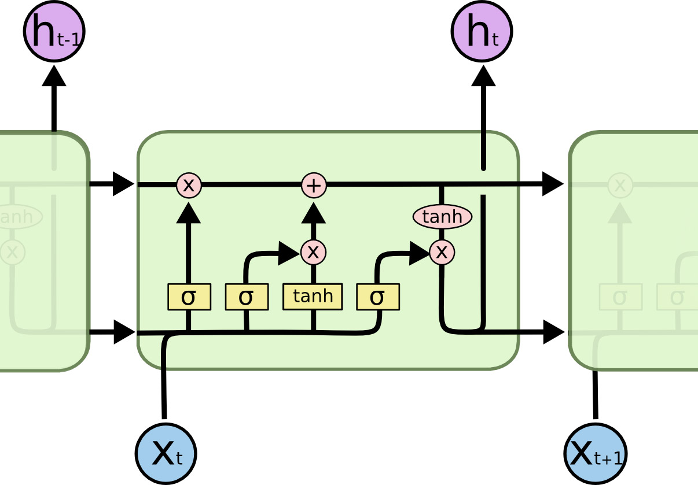

# Building a Pipeline for Aspect-Entity Extraction
*Getting started with NLP using sequence-to-sequence IOB2 tagging, pre-trained embedding vectors, stacked CNN/LSTM networks, and more.*

Natural Language Processing (NLP) involves the task of inferring useful information from text. Most elementary demonstrations of NLP involve sentiment analysis, i.e. categorizing an opinion as positive or negative. In this demonstration I tackle a more sophisticated task, namely [aspect-entity](https://link.springer.com/chapter/10.1007/978-3-642-40837-3_1) extraction.

I’ll show how we can get started building a machine learning pipeline for analysing customer reviews of restaurants that identifies:

1. All **entities** for which opinions are being expressed, e.g. the restaurant, the food, or the service, along with their specific “target” words or “**opinion-term expressions**” (OTEs); i.e. the waiter, the roast beef, the wine, the decor.
2. The particular **aspect** of those entities being discussed; i.e. quality, price.
3. And the particular **sentiment** being expressed towards the aspect-entity pair; i.e. positive, negative, or neutral.

In the process, we’ll see how to implement several important NLP techniques, including:

* Text cleaning, contraction expansion, and lemmatization.
* Converting text sequence elements into pretrained embedding vectors.
* Creating Parts-of-Speech (POS) tags.
* Sequence-to-sequence IOB2 tagging for OTE identification.
* Creating an end-to-end inference pipeline.

Our final network will be able to take the following example review sentence…

>“Service was terribly slow and the restaurant was noisy, but the waiter was friendly and the calamari was very delicious.”

…and produce the following output tuples:

1. (“service”, SERVICE:GENERAL, negative)
2. (“restaurant”, AMBIENCE:GENERAL, negative)
3. (“waiter”, SERVICE:GENERAL, positive)
4. (“calamari”, FOOD:QUALITY, positive)

## Usage

Please run the ipython notebook `aspect-entity.ipynb`.

**Note for github users**: A rendered preview of the executed notebook can be found [here](http://rpmarchildon.com/wp-content/uploads/2018/10/RM-W-NLP-AspectEntity-vF1.html).