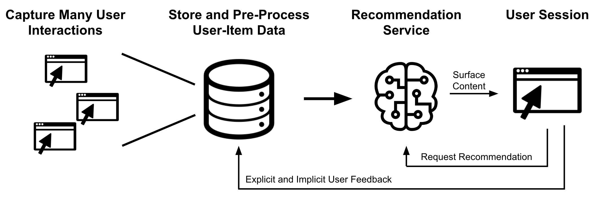
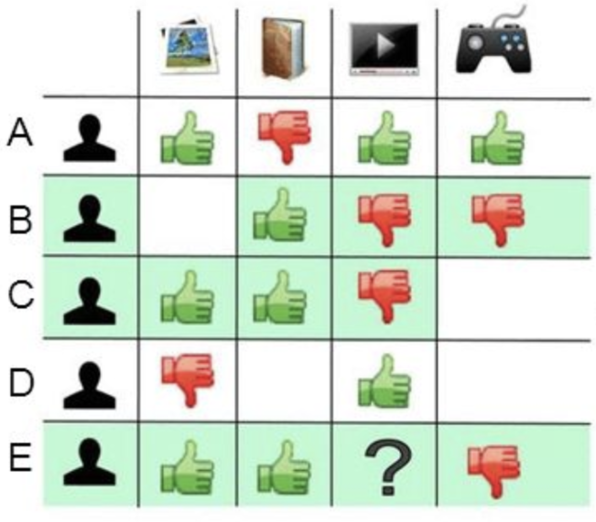
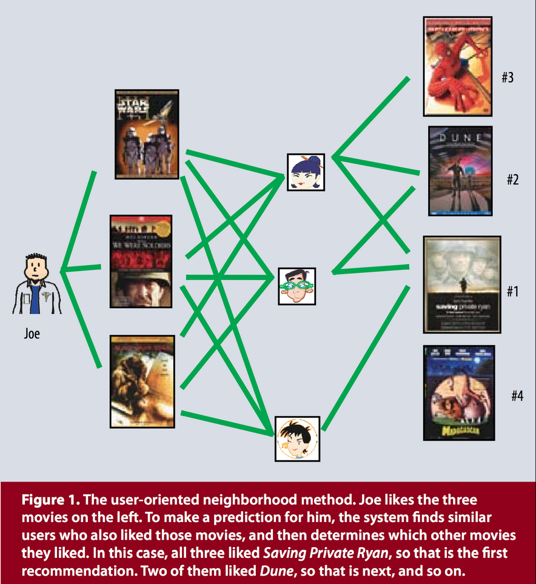
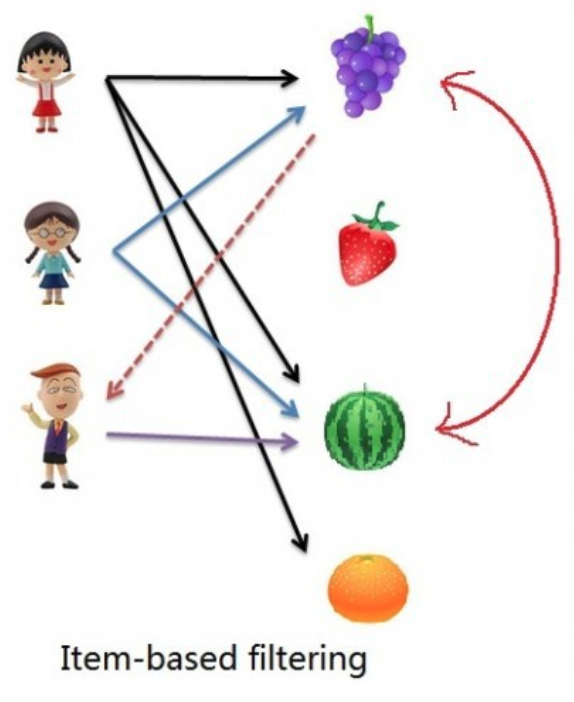
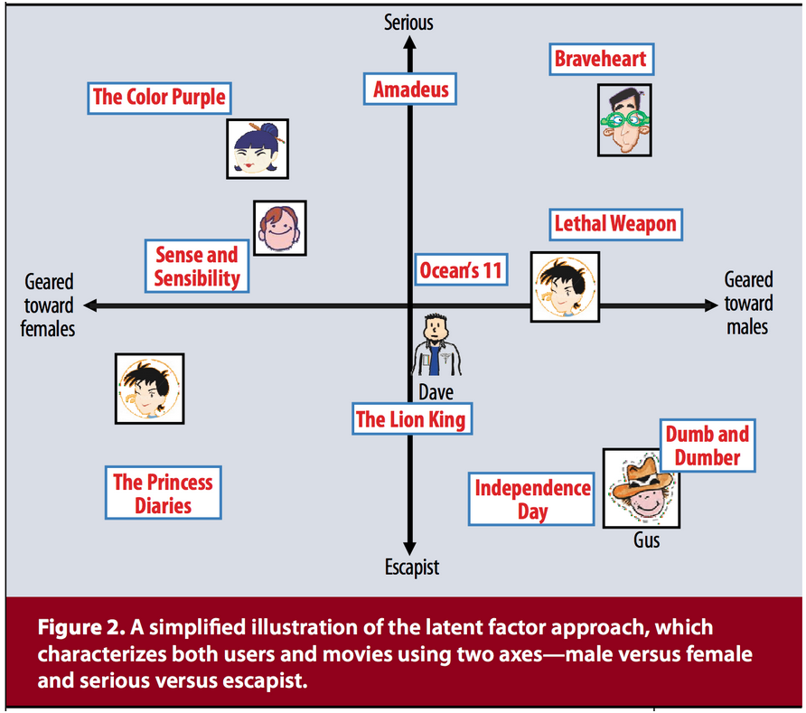
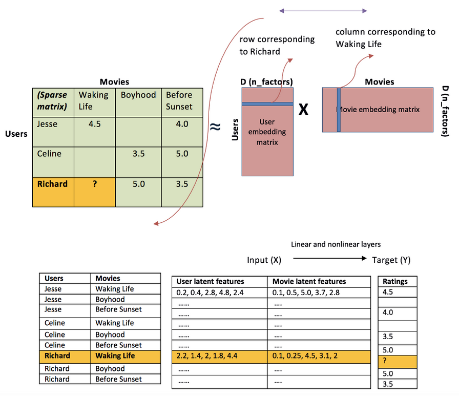
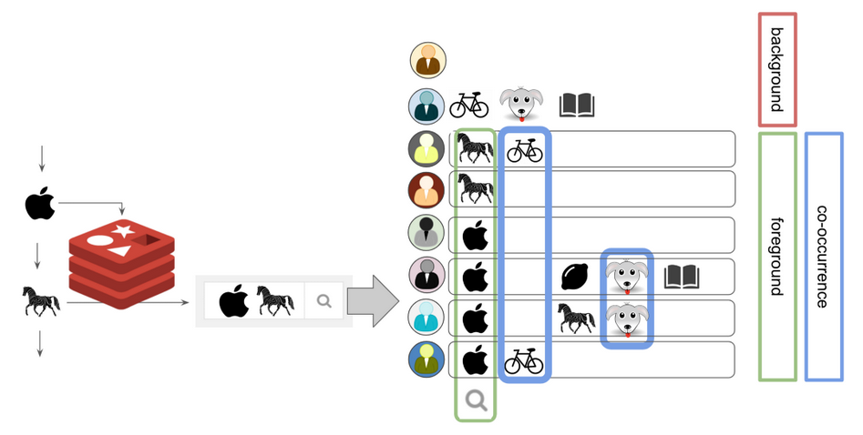

# Intro to Recommender Systems

2019/08/10

Presenter: Ryan Marchildon

This workshop teaches the basics of how recommendation systems work and how to get started with building your own.

**Important Note:** This workshop was presented as an interactive notebook `recommendation-systems.ipynb` found in this directory. The workshop contents have been copied below, but Github does not support rendering of LaTeX equation markup, hence some content will not display correctly. To render all equations, get a code-interactive version of this talk and execute the code cells, please launch the aforementioned jupyter notebook.


## A) Why Recommendation Systems are Useful

Modern consumers are flooded with choices. Electronic retailers offer enormous collections of products and content meeting a variety of needs and tastes. Navigating this content can be both overwhelming and time-consuming, and there is no guarantee that the user will find the material best suited to their interests. This in turn negatively impacts the user experience. 

Case-in-point, today the main reasons why a user abandons an e-commerce experience are: (a) lack of relevance or (b) feeling overwhelmed. 

So how can we do better? **Recommendation systems** are one response. In brief, recommenders do the hard work of searching through vast collections of content, to surface the content most likely to be of relevance to the user. 

Where do we see recommendation systems in modern everyday life? Some easy examples are Amazon, Spotify, and Netflix. All three of these massively successful companies have recommendation services at the core of their user experience. They were early to see the value, and reaped the benefits accordingly. 

Most content- or product-delivering organizations should now consider adopting recommendation systems as part of their strategy. Users are coming to expect more personalized experiences. Matching users with the most appropriate content is key to enhancing user satisfaction and loyalty. With so many vendors to choose from, organizations that fail to adopt a personalization strategy will be left in the dust. 

> "In a few years from now, 89% of businesses will compete mostly on customer experience."  *- Gartner Research, 2017* 


## B) Spotting Use Cases

Consider how recommendation systems might apply in each of the following user stories:

**Story 1 | E-Commerce:** As a shopper on a large e-catalogue, I'm faced with an overwhelming number of choices and need guidance on finding relevant products that suit my aims and tastes. 

**Story 2 | Media Platform:** As a user, I want to more easily discover new content (music, tv shows, or articles) that I might enjoy. 

**Story 3 | Vacation Booking Platform:** As a user booking a vacation, I want to more easily find suitable accommodations, vehicle rentals, and activities that match my needs and tastes. 


From a user's perspective, common needs that can be a flag for leveraging recommendation systems include:

* Help me choose. 
* Help me discover. 
* Help me achieve my goal. 
* Help me feel less overwhelmed. 

Ultimately, a well-designed recommendation system helps the user achieve their goals faster and more pleasantly. 

**Brainstorm**: Can you think of other uses? What about recommending prices when you upload an item to a used goods market? Or recommending which restaurants to eat at? ...


## C) The Ingredients of a Recommendation System

Recommendaton systems are powered by `data` collected about your users, your content, and user interactions with your content. This data is used to tune a predictive model which generates recommendations based on content similarity or the recorded history of user actions. 




### Key Infrastructure Components

1. Data collection
2. Data storage
3. Data preprocessing pipeline
4. Model / Service


### Types of Recommendation Models
* Content-Based
* Collaborative Filtering
  * Neighbourhood Methods
    * Cosine Similarities
  * Latent Factor Methods
    * Singular Value Decomposition
    * Stochastic Gradient Descent
    * Alternative Least Squares

We'll expand on many of these later. 

### Types of Data

**Explicit User Feedback**
Unbiased data on a user's tastes and preferences. This should be your primary source of data for developing recommendation aglorithms. 

* ratings given (e.g. stars, likes)
* product purchases
* videos watched (defined by some minimum viewing time)
* songs listed to
* articles read
* ...

**Implicit User Feedback**
Potentially biased as these can be influenced by how content is presented on a page or by "click-baitability". Click-baitable content may have a high click rate, but then a low dwell time or high bounce-back rate. Can be helpful in fine-tuning algorithms or mitigating the cold-start problem, but results will generally be poorer compared to explicit user feedback. 
* page views
* clicks
* search queries
* dwell times
* ...

**User Metadata**
User-supplied information:
* age and demographics
* user-completed surveys (e.g. "which of these are you interested in"?)
* user-specified constraints (e.g. child filter on movies)
* ...

**Content Metadata**
* artist / author
* keyword tags
* group tags (e.g. album or series)
* genre / subject
* ...


## D) Recommendations by Collaborative Filtering

In collaborative filtering, we leverage trends in user ratings to try to predict which items will be most relevant. *Note: instead of 'ratings', we could just as easily use other forms of explicit user feedback, such as video views, etc.* 

As a pre-requisite, we need to prepare a user ratings matrix, where the rows correspond to users ($u$), the columns correspond to items ($i$), and the matrix elements correspond to user rankings of each item ($r_{ui}$).



*(Above) The ratings of users (b) and (c) are in agreement with user (e) on all items for which user (e) has provided a rating. Can we therefore use the ratings from users (b) and (c) to predict user (e)'s rating of the laptop?*


There are two types of collaborative filtering, which attack the same problem from slightly different angles:

* **User-Based**: We look at users with similar item ratings patterns as you, and see how those users rated other items to select our recommendations. 
> *"Users like me also looked at these other items..."*





* **Item-Based**: We look at which users rated a given item highly, and see how those users rated other items to select our recommendations. 
> *"Users who looked at this item also looked at these other items..."*



*(Above): The bottom user has viewed the watermellon. Both of the other two users who viewed the watermellon also viewed the grapes, so recommend the grapes.*


## Building the Ratings Matrix

We'll demonstrate collaborative filtering on a subset of the [movielens dataset](https://grouplens.org/datasets/movielens/), which contains 100000 ratings of 9000 movies by 600 users, plus movie metadata including 3600 tags (e.g. genre). But we could apply these same techniques to any dataset (e.g. hotel recommendations, blog article reads, youtube video views, etc). 

**Import Python Libraries**
```python
import os
import json
import numpy as np
import pandas as pd
```

**Obtain Data**
```python 
# download the movielens dataset
!curl -O http://files.grouplens.org/datasets/movielens/ml-latest-small.zip
!unzip -o ml-latest-small.zip
```

```python
# load it into dataframes
MOVIELENS_PATH = os.path.join(os.getcwd(), 'ml-latest-small')
df_movies = pd.read_csv(os.path.join(MOVIELENS_PATH, 'movies.csv'))
df_ratings = pd.read_csv(os.path.join(MOVIELENS_PATH, 'ratings.csv'))
df_tags = pd.read_csv(os.path.join(MOVIELENS_PATH, 'tags.csv'))
# df_links = pd.read_csv(os.path.join(MOVIELENS_PATH, 'links.csv'))
print('Dataframes loaded.')
```

**Preview the data**

```python
# preview the dataframes
df_movies.head(3)

df_ratings.head()

df_tags.head(3)
```


**Create Movie Name Dictionary**

Map `movieId` to the movie `title`.
```python
numbers_to_names = {}
for _, row in df_movies.iterrows():
    numbers_to_names[row['movieId']] = row['title'].split(' (')[0]

print('Movie 1:', numbers_to_names[1])
print('Movie 2:', numbers_to_names[2])
print('Movie 3:', numbers_to_names[3])
```

**Create User Ratings Matrix**
```python
# create a ratings table, with userID as the rows and movieId as the columns
df_ratings_matrix = pd.crosstab(df_ratings.userId, df_ratings.movieId, df_ratings.rating, aggfunc=np.sum)

# fill NaN values (i.e. not rated) with a zero
df_ratings_matrix = df_ratings_matrix.fillna(0)

df_ratings_matrix.head(10)
```

```python
# convert to numpy array
ratings_matrix = df_ratings_matrix.as_matrix()
ratings_matrix.shape
```

### Determining User and Item Similarity

Each row in the ratings matrix can be thought of as a vector $\vec{r}$ of a user's ratings across a geometric 'space' of items. Think of each item as having a corresponding orthogonal geometric axis, and the rating for that item corresponds to the distance along that axis. A user's tastes are thus represented by a coordinate in multi-dimensional item space, pointed to by $\vec{r}$. If we want to measure the similarity of two users, we can do so mathematically by calculating how 'close' these vectors are in item space.

For this we use **cosine similarity**, which is simply the normalized inner product (overlap) of two vectors. If we consider two different users, $u$ and $u'$ with corresponding ratings vectors $\vec{r}_{u}$ and $\vec{r}_{u'}$, their cosine similarity is given by:

\begin{equation*}
\mathrm{sim}(u, u') = \cos(\theta) = \frac{\vec{r}_{u} \bullet \vec{r}_{u'}}{ \vert\vec{r}_{u}\vert \vert \vec{r}_{u}' \vert} = \sum_{i} \frac{r_{ui} r_{u'i}}{\sqrt{\sum_{i} r^{2}_{ui}} \sqrt{\sum_{i}r^{2}_{u'i}}}
\end{equation*}

where $r_{ui}$ is the rating by user $u$ for item $i$. 

Let's look at a few cases and the values for $\cos(\theta)$ they would give. 
* A value of 1 corresponds to perfect overlap between two user ratings vectors, e.g. they both rated the same films, and gave the same ratings to each film. 
* A value of 0 corresponds to zero overlap; e.g. the two users have rated completely different films. 
* A value of -1 might correspond to users who rated the same films but gave opposite ratings. 

For more details and some visualizations, an extended discussion of cosine similarity can be found [at this link](https://www.machinelearningplus.com/nlp/cosine-similarity/). 

The matrix $\mathrm{sim}(u, u')$ is called the similarity matrix between users. Similarly, we can compute a similarity matrix between items $\mathrm{sim}(i, i')$ by swapping $i$ and $u$ in the above equation. 

We could compute the similarity matrix by iterating over each row and column of the ratings matrix, but this would be computationally expensive and take a long time to complete for large datasets. So instead we'll take advantage of python's vectorized functions. It can be proven that the computation is equivalent to: 

\begin{equation*}
\mathrm{sim}(u, u') = \frac{\textbf{R} \textbf{R}^{T}}{DD^{T}} 
\end{equation*}

where $D$ is a vector containing the square root of the diagonal elements of $\textbf{R} \textbf{R}^{T}$.

Similarly,


\begin{equation*}
\mathrm{sim}(i, i') = \frac{\textbf{R}^{T} \textbf{R}}{NN^{T}} 
\end{equation*}

where $N$ is a vector containing the square root of the diagonal elements of $\textbf{R}^{T} \textbf{R}$.


```python
def get_similarity_matrix(ratings, kind='user', epsilon=1e-9):
    
    # epsilon is a small number for handling divide-by-zero errors
    
    if kind == 'user':
        sim = ratings.dot(ratings.T) + epsilon
        
    elif kind == 'item':
        sim = ratings.T.dot(ratings) + epsilon
    
    # vector of normalization factors
    norms = np.array([np.sqrt(np.diagonal(sim))])
    
    return (sim / np.outer(norms, norms))

sim_user = get_similarity_matrix(ratings_matrix, kind='user')

sim_item = get_similarity_matrix(ratings_matrix, kind='item')

```

### Predicting User Ratings from the Similarity Matrix

The simplest way to predict the rating (r) that would be given be a user (u) for a movie (i) is by taking a weighted sum of the ratings for that movie by all other users, where the wighting is the cosine similarity between this user (u) and other users (u'). We should also renormalize this by the sum of the weights.

\begin{equation*}
\hat{r}_{ui} = \frac{\sum_{u'}\mathrm{sim}(u, u')r_{u'i}}{\sum_{u'}\vert\mathrm{sim}(u, u')\vert}
\end{equation*}

```python
# mathematically equivalent to this vectorized function
def predict_simple_cf(ratings, similarity, kind='user'):
    if kind == 'user':
        return similarity.dot(ratings) / np.array([np.abs(similarity).sum(axis=1)]).T
    
    elif kind == 'item':
        return ratings.dot(similarity) / np.array([np.abs(similarity).sum(axis=1)])

preds_user = predict_simple_cf(ratings_matrix, sim_user, kind='user')
preds_item = predict_simple_cf(ratings_matrix, sim_item, kind='item')
```

Let's test this out to retrieve the top N recommendations for a specified user. First, let's create a mapping from array column indices back to movie names.

```python
movie_ids = list(df_ratings_matrix.columns.values)
array_id_to_movie_id = {}
for idx in range(ratings_matrix.shape[1]):
    array_id_to_movie_id[idx] = movie_ids[idx]

def convert_to_names(array_ids):

    top_movie_ids = [array_id_to_movie_id[idx] for idx in array_ids]
    top_movie_names = [numbers_to_names[idx] for idx in top_movie_ids]

    return top_movie_names
```

#### User-Based Recommendations

Now let's create a function that obtains and prints the recommendations, and compares these to the user's top N rated films.


```python
def get_top_N_recommendations_user(user_id, ratings, pred_ratings, N):
    
    # isolate the vectors for this user
    known = ratings[user_id, :]
    preds = pred_ratings[user_id, :]
    
    # get indices of movies this user has already rated
    rated_movie_indexes = np.where(known != 0)[0]
    print('User %s has already rated %s movies.\n' %(user_id, len(rated_movie_indexes)))
    
    # arrange the movie indices from highest to lowest predicted rating
    ranked_indices_preds = np.argsort(preds)[::-1] # note, [::-1] performs a reversal
    
    indices_top_ratings = []
    for idx in range(ranked_indices_preds.size):
        if ranked_indices_preds[idx] not in rated_movie_indexes.tolist():
            indices_top_ratings.append(ranked_indices_preds[idx])
            
        if len(indices_top_ratings) == N:
            break
    
    # print the names of the top N movies this user has rated most highly
    ranked_indices_known = np.argsort(known)[::-1] # note, [::-1] performs a reversal
    top_rated_names = convert_to_names(ranked_indices_known)
    print('Top-Rated Films for User %s: \n' %user_id)
    for idx in range(N):
        print(top_rated_names[idx])
    
    # print the names of the top recommended movies they haven't rated
    print('\nTop Recommendations for User %s: \n' %user_id)
    top_recommended_names = convert_to_names(indices_top_ratings)
    for idx in range(N):
        print(top_recommended_names[idx])
    
    return indices_top_ratings

top = get_top_N_recommendations_user(42, ratings_matrix, preds_user, 10)
```

#### Top-k Collaborative Filtering 

An improvement to this is to utilize only the top $k$ most similar users (or items), instead of taking a weighted average over all of them. If we were to split our data into train and test sets, this would approximately halve our mean-squared-error. 

```python
def predict_topk(ratings, similarity, kind='user', k=40):
    pred = np.zeros(ratings.shape)
    
    if kind == 'user':
        for i in range(ratings.shape[0]):
            top_k_users = [np.argsort(similarity[:,i])[:-k-1:-1]]
            for j in range(ratings.shape[1]):
                pred[i, j] = similarity[i, :][top_k_users].dot(ratings[:, j][top_k_users]) 
                pred[i, j] /= np.sum(np.abs(similarity[i, :][top_k_users]))
    
    if kind == 'item':
        for j in range(ratings.shape[1]):
            top_k_items = [np.argsort(similarity[:,j])[:-k-1:-1]]
            for i in range(ratings.shape[0]):
                pred[i, j] = similarity[j, :][top_k_items].dot(ratings[i, :][top_k_items].T) 
                pred[i, j] /= np.sum(np.abs(similarity[j, :][top_k_items]))        
    
    return pred


preds_user_top_k = predict_topk(ratings_matrix, sim_user, kind='user', k=40)
```

```python
top = get_top_N_recommendations_user(2, ratings_matrix, preds_user_top_k, 10)
```

But you can see what's happening here --- we are encountering a `popularity bias`. More on this shortly. One way of countering this is to identify the most popular films in advance and mask their ratings in the ratings_matrix (filter them out so that we can find more user-specific signals). Another option is to curate the top recommendations to keep only a randomized subset (e.g. 1 or 2) of the most popular films and surface less popular content, or to weight the recommendations based on popularity. 

#### Item-Based Recommendations
Let's now use our predictions from item-based collaborative filtering:

```python
preds_user_top_k = predict_topk(ratings_matrix, sim_item, kind='item', k=40)

def get_top_N_recommendations_item(item_id, pred_ratings, N):
    
    # isolate the vectors for this user
    preds = pred_ratings[item_id, :]
    
    # arrange the movie indices from highest to lowest predicted rating
    ranked_indices_preds = np.argsort(preds)[::-1] # note, [::-1] performs a reversal
    
    indices_top_ratings = ranked_indices_preds[:N]

    print('Users who liked %s also enjoyed: \n' % convert_to_names([item_id])[0].split(',')[0])
    top_rated_names = convert_to_names(indices_top_ratings)
    for idx in range(N):
        print(top_rated_names[idx])
    
    return indices_top_ratings

top = get_top_N_recommendations_item(71, preds_user_top_k, 10)
```

***

***
### A Simple Library for Collaborative Filtering in JavaScript

Now that you know the basics of collaborative filtering and how to prepare a ratings matrix, you can easily make use of an existing node.js library for recommendations:

* https://www.npmjs.com/package/recommender

Scroll down to the heading "collaborative filtering" and "getTopFCRecommendations". Usage is simple:

```javascript
var recommender = require('recommender');
var ratings = [
    [ 4, 0, 0, 1, 1, 0, 0 ],
    [ 5, 5, 4, 0, 0, 0, 0 ],
    [ 0, 0, 0, 2, 4, 5, 0 ],
    [ 3, 0, 0, 0, 0, 0, 3 ]
];
var movieIndex = 0;
var userIndex = 4;
// We are predicting the rating of U05 for M1.
var predictedRating = recommender.getRatingPrediction(
    ratings, movieIndex, userIndex, (predictedRating) => {
        console.log(predictedRating);
// Output: 4
});
```

*Installation Instructions*
* `brew install python2`
* `npm config set python python2.7`
* `npm install recommender`

Note that this library requires that python 2.7 be installed on your system. Do this from terminal using `brew install python2`. (Backstory: some folks still use the outdated python 2, even though we should all be using python 3.6 by now, *sigh*). 

As the documentation points out, while this simple method can get the job done in many cases, there are still several drawbacks to relying on it too heavily. 

**Pros**
* Works for any kind of items (i.e. movies, songs, books etc..). No need for feature selection, you just need a matrix with ratings.
        
**Cons**
* `Cold start problem`. At the beginning of your recommendation system no users have rated anything yet, your utility matrix will be empty, so no ratings can be predicted.

* `Sparsity`. Most of the times your user/ratings matrix is very sparse. There are many items and many users, but users have only rated several items, so it's hard to find users that have rated the same items.

* `First rater problem.` When a new item is added, there are no ratings for it yet, so it can't be recommended to anyone. 

* `Popularity bias.` Also known as The Harry Potter Effect. The most popular items are recommended the most. So for example a movie like Harry Potter is a very popular item and it is recommended to a lot of people, but it is not that interesting and clouds some of the unique recommendations which could be shown to a user. Genrally when building recommender systems, for more exact results it is best to use a Hybrid recommender system, instead off just using only collaborative filtering or only content based filtering.


We'll address some of these issues shortly. 


### Collaborative Filtering via Latent Factors

Collaborative filtering methods that compute distance relationships (e.g. similarities) between users or items are thought of as "neighbourhood" methods since they center on the idea of "nearness". But an obvious issue with this approach is that it doesn't deal well with `sparse data` and doesn't model underlying 'taste' or 'preference' vectors directly.

Suppose one user has listened to and rated five songs by Madonna, and another user has listen to and rated five entirely different Madonna songs. Mathematically, the dot product of those user vectors would be zero. They'd be in entirely seprate neighbourhoods even though it seems obvious they have similar underlying preferences. 

We assume that tastes and preferences can be represented by 'neighbourhood' approaches, but clearly this is not always the case. So how can we derive better 'tastes' and 'preferences' vectors from the raw data? **Use latent factor models**.


#### Latent Factor Models

We can use various mathematical tricks to find a set of vectors (similar to eigenvectors) that give us a diagonalized representation of our ratings matrix. Mathematically, this can be thought of as a change of basis to a new coordinate system where the variance in the user-item interactions (i.e. ratings) are maximized along each axis, similar to principal component analysis (PCA). The vectors learned in this unsupervised manner might correspond to dimensions such as comedy versus drama, the amount of action, orientation towards children versus adults, or more abstract dimensions such as depth of character development or quirkiness (e.g. see illustration below). 



Latent factors can be discovered through **singular value decomposition** (SVD) or techniques such as factorization with gradient descent. The result is a **item embeddings matrix**, which represents how much each 'feature' or 'dimension' is present in each movie, and a **user embeddings matrix**, which represents how much users "like" each feature. These matrices can be used to quickly make predictions on user preferences.  




#### Supervised-Learning Based Techniques

Using SVD for matrix factorization has numerous downsides.It is prone to overfitting, does not scale well computationally to large datasets, and needs 'complete' knowledge of a matrix (i.e. we must impute missing values). 

Alternatively, we can reformulate the factorization as a minimization problem. Let's define our model of a user's rating as

\begin{equation*}
\hat{r}_{ui} = q_{i}^{T}p_{u}
\end{equation*}

Where $q_{i}$ is an item embeddings matrix that measures the extent to which an item posseses the latent features, and $p_{u}$ is the user embeddings matrix that measures the extent of interest the user has in items that are high in the corresponding latent factors. 

To learn $q_{i}$ and $p_{u}$, we try to minimize the regularized squared error on the set of *known* ratings $r_{ui}$, subject to regularization:

\begin{equation*}
\min_{q,p} \sum_{(u,i) \,\in \, \kappa} (r_{ui} - q_{i}^{T}p_{u})^{2} + \lambda (\vert\vert q_{i}\vert\vert^{2} + \vert\vert p_{u}\vert\vert^{2})
\end{equation*}

Where $\kappa$ is the set of $(u, i)$ pairs for which $r_{u,i}$ is known (think of this as our training data). 

The approaches to minimizing this equation include
* stochastic gradient descent
* alternating least squares

For further details, see [this article](https://datajobs.com/data-science-repo/Recommender-Systems-%5BNetflix%5D.pdf) written by the team that won the 2009 Netflix prize. Some additional considerations include:

* `Bias`. The equation $\hat{r}_{ui} = q_{i}^{T}p_{u}$ tries to capture the interactions betwen users and items that produce the different ratings values. But much of the variation is due to effects associated with either users or items -- known as biases. For example, some users may tend to give higher ratings than others (systematic bias). Some items might be rated more favourably than the norm due to popularity (e.g. the book "Twilight"). Since biases tend to capture much of the observed signal, their accurate modelling is vital. 

* `Time Drift`. A user's tastes may change over time. An item's popularity may also change (e.g. songs by Rick Astley spiked in popularity again thanks to the [Rick-Roll meme](https://www.youtube.com/watch?v=3KANI2dpXLw))

* `User and Item Metadata`. More advanced techniques can incorporate implicit user feedback (e.g. browsing history) and well as explicit metadata (e.g. genre tags, keywords, user-specified preferences) into the training algorithm. 


## E) Content-Based Recommendations: Mitigating the Cold Start Issue

When you lack data initially, recommendations can be made through hardcoded business logic, or by recommending items based on similarity of metadata. For example, we could encode a movie's features such as genre, keywords, production studio, budget, lead actors/actresses, average rating, and popularity into a vector, and then find similar movies by computing the **cosine similarity**.

*Javascript Demo*

Within this notebook's root folder:
* `cd` into `movie-recommender-js`

* `npm install`

* `npm run-script data` to generate the data

* `npm start` to run the predictions script

We could also leverage other machine learning technologies, such as image recognition, or natural langue processing, to generate metadata tags that serves as features for content recommendation. 

Check out this article:
* [How Does Spotify Know You So Well?](https://medium.com/s/story/spotifys-discover-weekly-how-machine-learning-finds-your-new-music-19a41ab76efe) A software engineer explains the science behind personalized music recommendations, including how spotify leverages ML to find similarities among lyrics and the audio itself. (9 min read)


## F) Good Design Habits

Never lose sight of the user experience. 

* `Avoid content fatigue`. Recommending the same thing over and over again is boring and produces bad feedback data. Two mitigation strategies that are simple and intuitive are: `anti-flood`, where we penalize the 2nd and 3rd recommendations if they have almost the same similarity scores to the top result; `dithering`, where we add a wildcard recommendation to keep things interesting for the user and generate new datapoints (e.g. for newly-introduced products). 

* `Work with unbiased explicit feedback`, such as purchases, ratings, watching a video, etc. Unfortunately most of our data is often implicit feedback such as page views or clicks, but betware: these can be heaviy biased, for example the click rate could depend on the position of content on a page, or a clickbaity headline, rather than actual relevance. This leads to high bounce rates after initially high clickthrough rates. 

* `Combine a variety of approaches`. Hybrid approaches that combine many different algorithms typically yield the best results. For examlpe, the winners of the 2009 Netflix Prize used an ensemble method of 107 different algorithmic approaches, which were blended into a single predection. Hybrid (e.g. content-based and collaborative-based) methods can also be used to overcome some of the common problems in recommender systems such as cold start and the sparsity problem.

* `Be Sensitive to Ethics`. Recommendations can bring great value to clients and their users when deployed responsibly. However, we all occasionally hear stories about recommendation systems gone wrong. Facebook recently came under intense criticism about its news feed recommendations, which create an echo chamber that amplifies the polarization of extreme political views. This could have been addressed by including more diversity of viewpoints in the articles being recommended. Another well-known story is when Target predicted that a teenage girl was pregnant based on her shopping habits and sent a tailored brochure of recommended baby products to her family address. We should consider not only privacy around data, but also privacy around the recommendations themselves. The onus is on us to anticipate possible implications of our recommendation systems and include responses to these in our design thinking process. 


## H) Other References

### Datasets

Good sources listing a variety of datasets for you to experiment with if you don't have your own:

* https://www.kdnuggets.com/2016/02/nine-datasets-investigating-recommender-systems.html
* http://cseweb.ucsd.edu/~jmcauley/datasets.html


### APIs

Microsoft Azure has a [Recommender API](https://github.com/microsoft/Product-Recommendations/blob/master/README.md) that's actually quite good for getting started (i.e. you face the cold-start problem) and is worth checking out if you want to show early value with minimal setup. It's a decent service, albeit (surprisingly) it was just announced that its development has been discontinued!

### Leveraging ElasticSearch

The mathematics behind recommendation engines and search engines are strikingly similar. If we can reformulate recommendations as search queries, then search results are recommendations. And since most companies already have search engines, we can leverage the existing infrastructure. 



Example:

* We store all user-item interactions in a search index.
* When a user is on a page for apples we search for all users who have apples in elasticsearch. This defines our foreground population.
* We look for co-occurrence in our foreground which gives us puppies.
* We search for puppies in the background population.
* We calculate some kind of score for our puppy recommendation.

For example, using ElasticSearch's so-called [JLH score](https://opensourceconnections.com/blog/2016/09/09/better-recsys-elasticsearch/)

JLH = (fg_percentage - bg_percentage) * (fg_percentage / bg_percentage)

For more details, see these articles:

* https://towardsdatascience.com/how-to-build-a-recommendation-engine-quick-and-simple-aec8c71a823e
* https://developer.ibm.com/patterns/build-a-recommender-with-apache-spark-and-elasticsearch/


