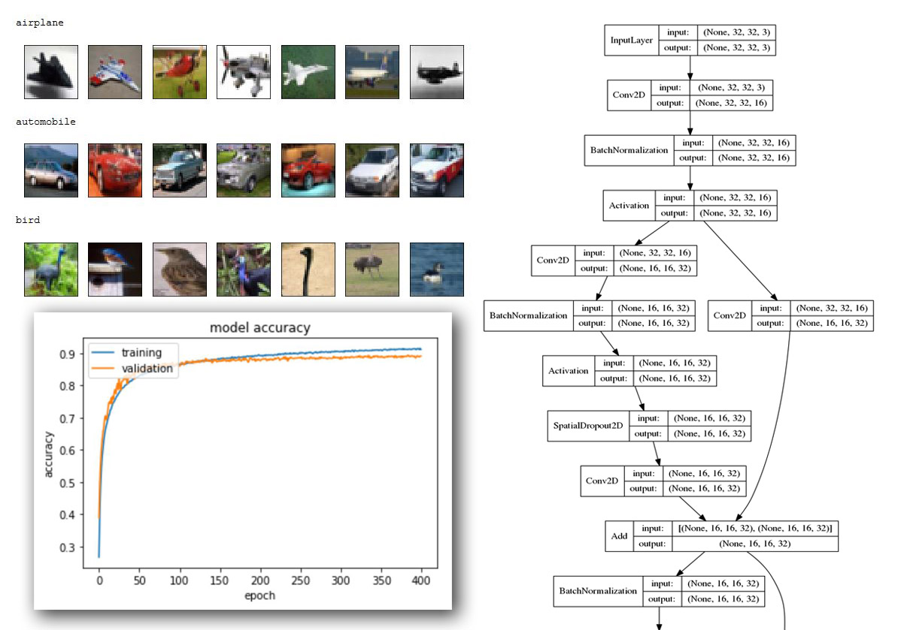

# Building VGG and Wide Residual Networks in Keras for Image Classification
An introduction to rapid network prototyping with Keras.

2018/08

In this tutorial I demonstrate how Keras can be used to quickly implement deep learning architectures for rapid prototyping. Specifically, I build and train two networks on the CIFAR-10 dataset with image augmentation:

 1. A simplified VGG architecture using the Keras Sequential API.
 2. A Wide Residual Network (WRN) using the Keras Functional API.

#### Why Keras?

In my [earlier tutorial](https://rpmarchildon.com/ai-cnn-digits/) I demonstrated how to use the low-level TensorFlow API to build and train a simple convolutional neural network (CNN). But such an approach is code-heavy and quickly becomes cumbersome when trying to rapidly prototype multiple ideas. Keras was designed to eliminate much of this overhead, making it faster to move from idea to experiment.

As well-articulated by Keras creator Francois Chollet in his post on the recent success of Keras in winning Kaggle competitions:

>“Your final models will typically share little in common with the solutions you envisioned when first approaching the problem, because …a-priori plans basically never survive confrontation with experimental reality. So winning is not so much about how good your theoretical vision is, it’s about how much contact with reality your vision has been through. …[Using] Keras allows you to iterate faster, to try more things. Ultimately, this enables you to win competitions (or publish papers). Being able to go from idea to result with the least possible delay is key to doing good research —that’s one of the core beliefs behind Keras.”

A link to a preview of the fully-executed notebook is found [here](http://rpmarchildon.com/wp-content/uploads/2018/09/RM-W-Keras-VGG-WRN-vF1.html).

